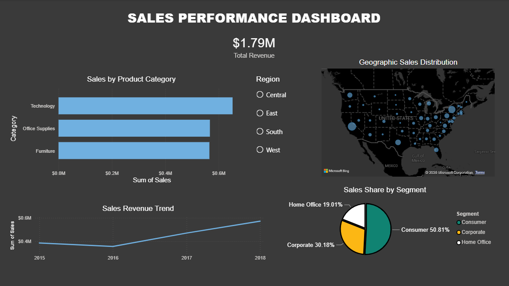

# Sales Performance Dashboard

## Project Overview

This project was created using Power BI and a public Superstore sales dataset.

The objective was to analyze sales performance across product categories, customer segments, regions and time periods through an interactive dashboard.

## Tools Used

- Power BI
- Microsoft Excel
- CSV Dataset

## Dashboard Features

- Total Revenue KPI
- Sales by Product Category
- Sales Revenue Trend
- Geographic Sales Distribution
- Sales Share by Customer Segment
- Interactive Region Filter

## Dataset

This project uses a public Superstore sales dataset for learning and portfolio purposes.

## Files Included

- sales_performance_dashboard.pbix
- superstore_dataset.xlsx
- raw_superstore_data.csv
- sales_dashboard_screenshot.png

## Dashboard Preview

